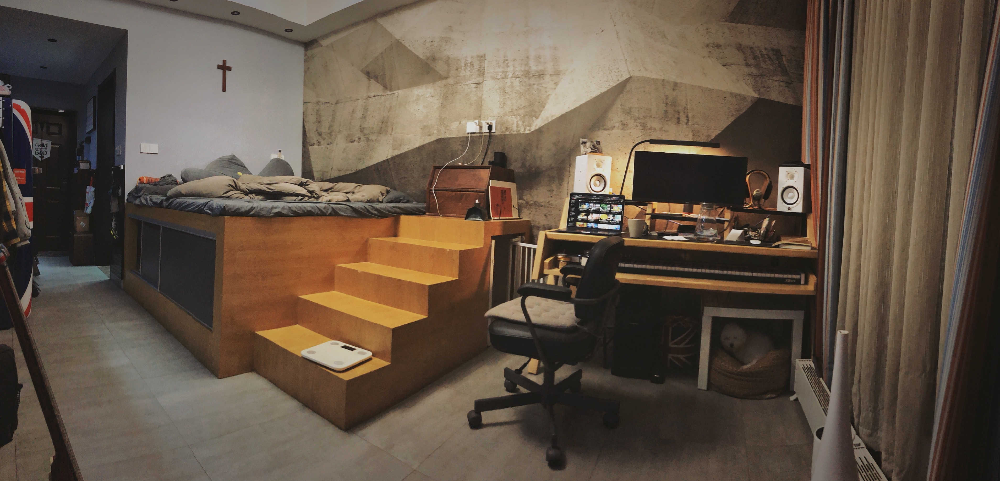
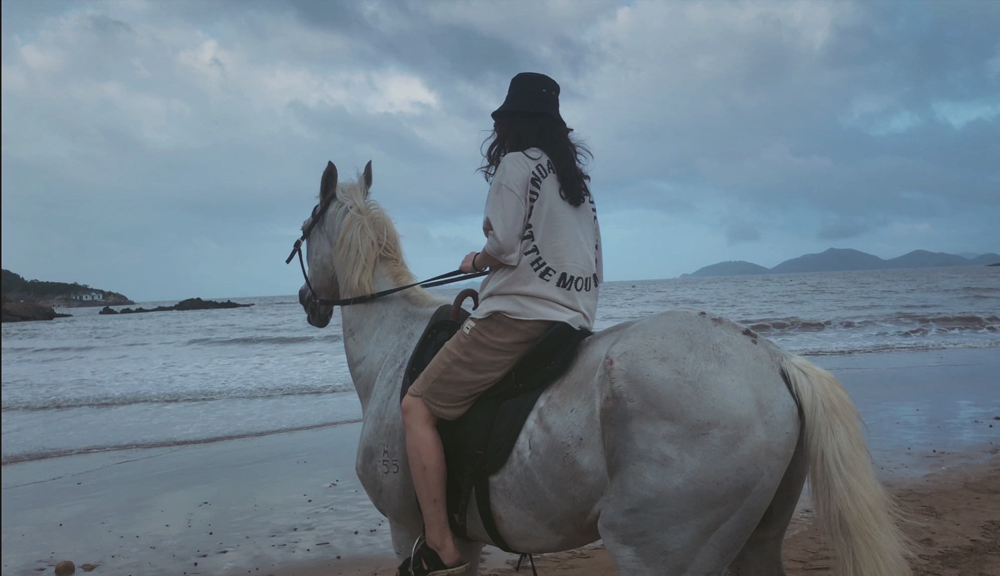
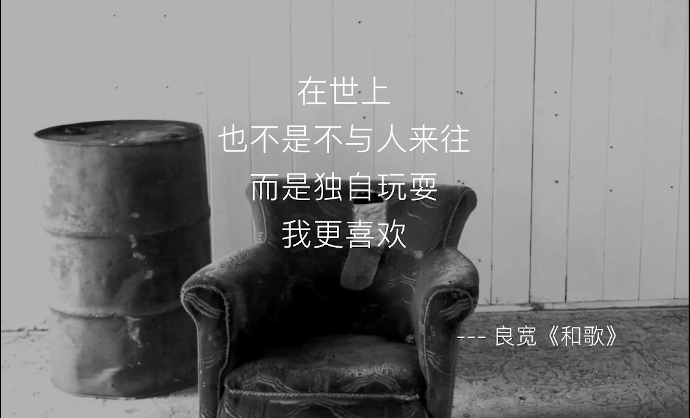

# Blog

<!--author-->

## 二零二一 凡所過往 | 皆為序章
----

### Dec 27th | Monday

> 你六日要作工，第七日要安息。

> 虽在耕种收割的时候，也要安息。

----

### Dec 16th | Thursday

有些事我可能会一直不明白。

恩。

----

### Dec 15th | Wednesday

我们总想做瓦器里的宝贝，

却忘了自己只不过是瓦器、

宝贝是耶稣。

----

### Sep 18th | Saturday

你要静默无声

待主为你征战

